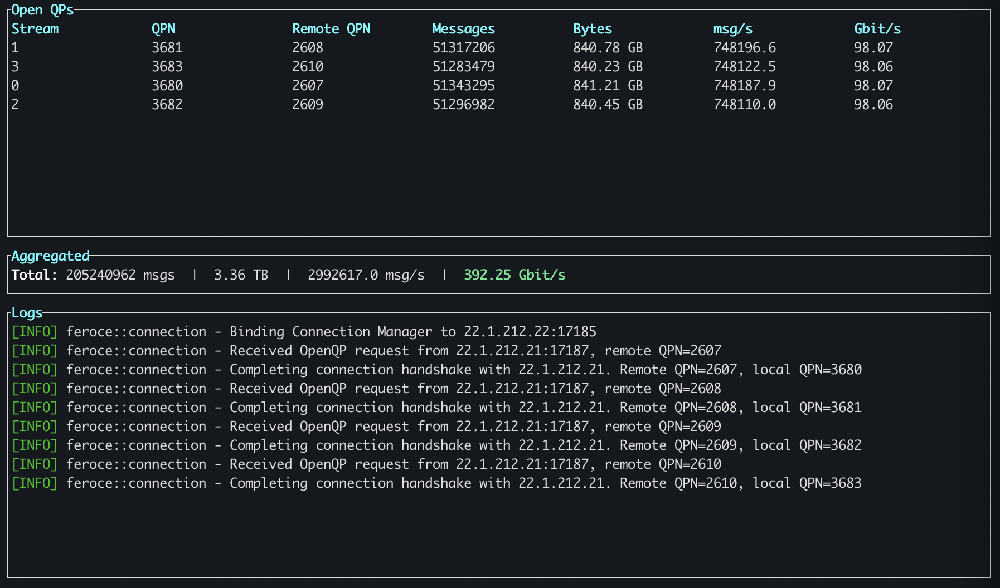

# feroce-rs

Rust library and CLI for the [FERoCE](https://github.com/Gabriele-bot/100G-verilog-RoCEv2-lite) (Front-End RoCE) FPGA network stack.

This Cargo workspace contains two crates:
- **feroce**: library implementing the connection manager (CM) protocol, RDMA data path, and GPU bindings.
- **feroce-cli**: sender/receiver application for testing and benchmarking.

> **Note:** The primary use case is receiving data from the FERoCE FPGA (RX path).
> The sender (TX path) is included for testing and benchmarking without FPGA hardware.

### Requirements

- Rust 1.93+
- `libibverbs-dev`, `rdma-core`, `clang` (for bindgen)
- An RDMA-capable NIC (RoCE v2) for hardware tests
- NVIDIA GPU + CUDA toolkit (optional, for GPUDirect support)

### Build

Optional features (can be combine as needed):

```bash
cargo build --release --features gpu       # GPUDirect support
cargo build --release --features tui       # TUI dashboard
cargo build --release --features gpu,tui   # both
```

The binary is produced at `./target/release/feroce-cli`.

## Usage

Start the receiver (passive mode, waits for connections):

```bash
./target/release/feroce-cli recv \
      --rdma-device mlx5_0 --gid-index 3 \
      --buf-size 16384 --num-buf 128
```

Then the sender (active side, initiates the connection):

```bash
./target/release/feroce-cli send \
      --rdma-device mlx5_0 --gid-index 3 \
      --buf-size 16384 --num-buf 128 \
      --active --remote-addr 192.168.1.1 --remote-port 0x4321 \
      --num-msgs 100000
```

For GPUDirect, build with `--features gpu` and pass `--gpu` to the receiver (sender settings stay the same):

```bash
./target/release/feroce-cli recv \
      --rdma-device mlx5_0 --gid-index 3 \
      --buf-size 16384 --num-buf 128 --gpu
```

To dump received payloads for inspection, pass `--dump-file <PATH>` to the receiver. With multiple streams each stream writes to `<stem>.NNN.<ext>`. Works for both CPU and GPU receive paths; intended for debugging, not high-rate runs.

See all available options with:

```bash
./target/release/feroce-cli recv --help
./target/release/feroce-cli send --help
```

## TUI dashboard

Build with the `tui` feature and pass `--tui` to the `recv` or `send` subcommand to enable a live dashboard:

```bash
./target/release/feroce-cli recv --tui ...
```

Press `Ctrl+C` to quit. When `--tui` is enabled, logs are written by default to `$HOME/feroce.log`.



## Control commands (test firmware only)

The `ctrl` subcommand sends UDP control messages to the data generator present in the test firmware. It is **not** part of the normal data flow — `send`/`recv` handle their own connection lifecycle, including QP cleanup on shutdown. Use `ctrl` only when interacting with the test-firmware data generator or when a stale QP needs to be closed manually after an unclean exit.

### Start a transfer (`tx-meta`)

Configure and trigger the firmware data generator:

```bash
./target/release/feroce-cli ctrl \
      --remote-addr 22.1.212.10 --remote-port 0x4321 \
      tx-meta --rem-qpn 0x100 --length 16384 --n-transfers 10000
```

### Close a remote QP (`close-qp`)

```bash
./target/release/feroce-cli ctrl \
      --remote-addr 22.1.212.10 --remote-port 0x4321 \
      close-qp --rem-qpn 256
```

On success the log shows `CloseQP acknowledged`.

> Normally you don't need to run `close-qp` manually — `feroce-cli recv` closes all open QPs on shutdown (including Ctrl+C, errors, and partial-setup failures). This command exists for the rare case where the application exits without cleaning up.

All available options can be viewed with:

```bash
./target/release/feroce-cli ctrl tx-meta --help
./target/release/feroce-cli ctrl close-qp --help
```

## Tests

Unit tests for the connection manager run without additional hardware:
```bash
cargo test
```

RDMA tests (requires a RoCEv2-capable NIC):
```bash
cargo test --features rdma-test -- --nocapture
```

GPU tests (requires RoCEv2 NIC + NVIDIA GPU):
```bash
cargo test --features rdma-test,gpu -- --nocapture
```

CLI integration tests (sender/receiver loopback):
```bash
cargo test --features rdma-test -p feroce-cli -- --nocapture
```

## Docker

Docker images used by CI can also be used for local testing:

```bash
# build the image (or pull it from the registry)
docker build -f ci/Dockerfile -t feroce-rs .
# run RDMA tests
docker run --rm --network=host --device=/dev/infiniband \
      -v $(pwd):/work -w /work feroce-rs cargo test --features rdma-test
```

Similarly for GPUDirect tests (requires nvidia-container-toolkit):
```bash
docker build -f ci/Dockerfile.gpu -t feroce-rs-gpu .
docker run --rm --gpus all --network=host --device=/dev/infiniband \
    -v $(pwd):/work -w /work feroce-rs-gpu cargo test --features gpu,rdma-test
```
